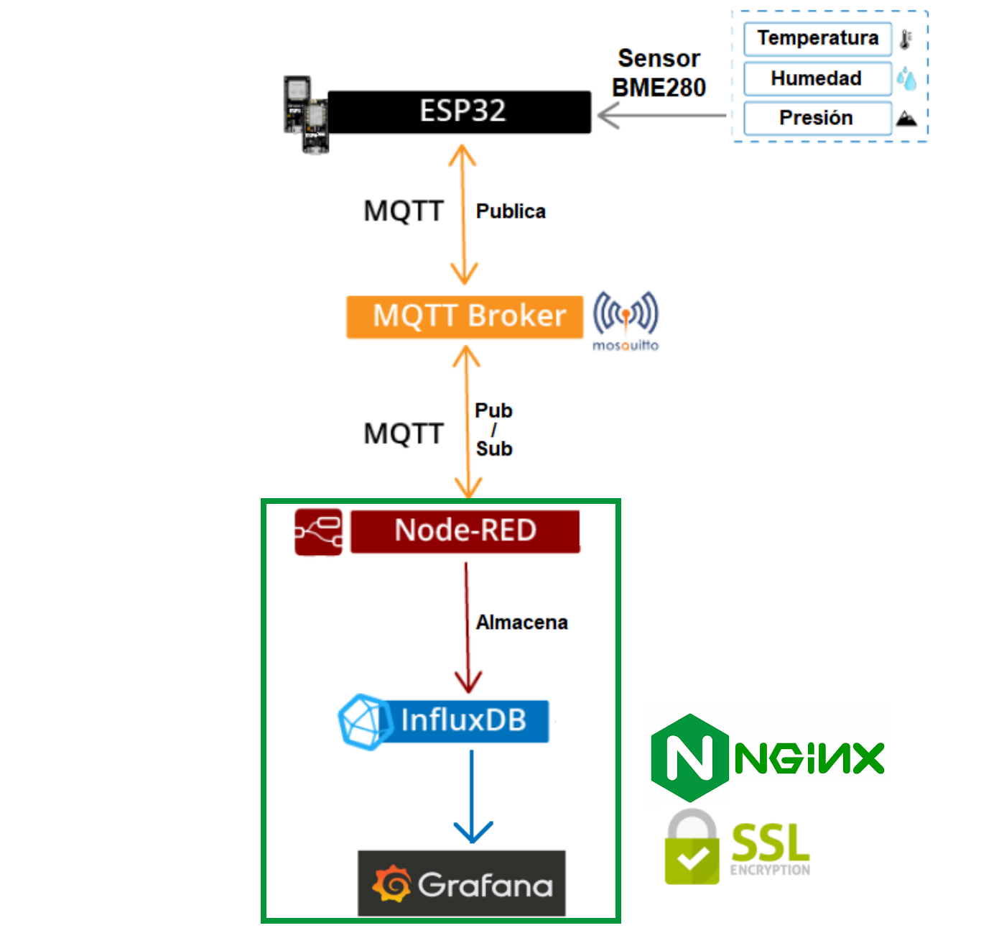
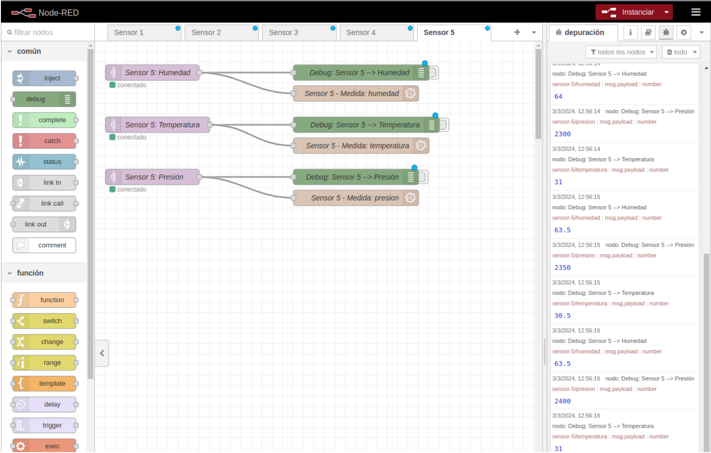
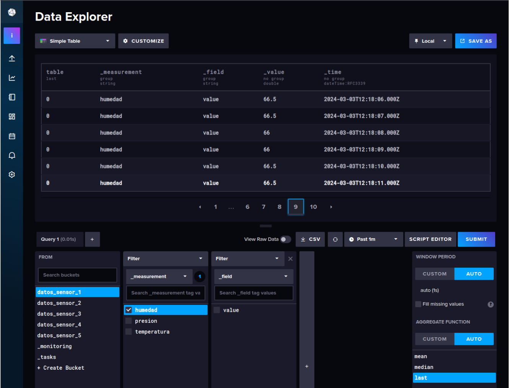
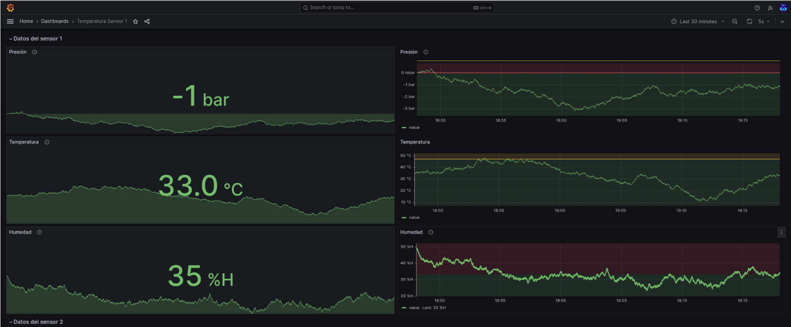

# Proyecto de Captura de Datos IoT con Docker Compose

Este proyecto utiliza Docker Compose para crear un sistema de captura de datos orientado a dispositivos IoT. A través de una arquitectura que simula el flujo de datos como si fuera streaming, permite comprender cómo se manejan los datos en un entorno cercano a Big Data, aunque no se trabaje con volúmenes que califiquen como tal.


## Herramientas Utilizadas

El sistema se apoya en varias herramientas clave para la captura, manejo, almacenamiento y visualización de los datos:

- **Mosquitto:** Un broker MQTT que facilita la captura y gestión de mensajes entre dispositivos.
- **Node-Red:** Una herramienta de programación visual para conectar dispositivos IoT y servicios en línea mediante flujos de datos.
- **InfluxDB:** Una base de datos optimizada para almacenar y consultar series temporales de datos.
- **Grafana:** Una plataforma de análisis y visualización de datos que permite crear cuadros de mando dinámicos.
- **Debian:** Un contenedor que simula el envío de datos de sensores IoT.
- **Nginx:** Un contenedor proxy inverso para configurar certificado SSL.


## Arquitectura a montar

<div style="width: 70%; margin: auto; text-align: center;">
    
</div>

## Entornos de Ejecución

### Entorno de Desarrollo

En el **entorno de desarrollo**, la idea es simular datos de sensores sin necesidad de tener sensores físicos. Esto se logra mediante un script bash que se ejecuta dentro de un contenedor basado en Debian. Este script está diseñado para simular la salida de 10 sensores, enviando datos a un broker MQTT (Mosquitto) cada segundo, utilizando el comando `mosquitto_pub`. Usaremos `Dockerfile` para proporcionar todas las instrucciones necesarias para construir este contenedor, incluyendo la instalación de Mosquitto (y sus herramientas cliente), así como la colocación del script de simulación dentro del contenedor.

Para activar este entorno de desarrollo, se utiliza Docker Compose con perfiles. El perfil de desarrollo se define en el archivo `docker-compose.yaml`, bajo la sección `profiles`. Esto permite que ciertos servicios, como el contenedor Debian que ejecuta el script de simulación, solo se inicien cuando se especifica su perfil correspondiente. El comando para iniciar este entorno es:

```bash
docker compose up --profile desarrollo
```

Al ejecutar este comando, Docker Compose busca en el archivo `docker-compose.yaml` todos los servicios marcados con el perfil `desarrollo` y solo inicia esos servicios, dejando de lado cualquier otro que no esté asociado con dicho perfil.

### Entorno de Producción

Para el **entorno de producción**, la configuración cambia significativamente. En producción, se espera recibir datos reales de los sensores en lugar de simularlos. Esto significa que no se necesita el contenedor Debian que ejecuta el script de simulación. Por lo tanto, en el contexto de producción, no se utiliza el perfil de desarrollo, y el comando para levantar el entorno de Docker Compose omite el parámetro `--profile`, como se muestra a continuación:

```bash
docker compose up
```

Este comando inicia todos los servicios definidos en el archivo `docker-compose.yaml` que no están asociados explícitamente con un perfil o que son necesarios en todos los entornos, como podrían ser los contenedores para Mosquitto, bases de datos, y cualquier otro servicio esencial para la operación de la aplicación en producción.

## Configuración de los Contenedores

Los servicios definidos en `docker-compose.yaml` incluyen:

- `iot-mosquitto`: El broker MQTT.
- `iot-nodered`: Entorno de programación visual para IoT.
- `iot-influxdb`: Base de datos para las series temporales.
- `iot-grafana`: Herramienta de visualización de datos.
- `iot-debian`: Contenedor que ejecuta el script de simulación de sensores.
- `iot-nginx`: Contenedor que desvía todo el tráfico usando un certificado SSL/TSL.

### Acceso a los Servicios

- **Mosquitto:** mqtt://localhost:1883
- **Node-Red:** http://localhost:1880 ó https://localhost/nodered/
- **InfluxDB:** http://localhost:8086 ó https://localhost/influxdb/
- **Grafana:** http://localhost:3000 ó https://localhost/grafana/

## Consideraciones a tener en cuenta

### Mosquitto

1. He añadido configuracion en el directorio `./config/mosquito`.
2. Para poder ver el log tendrás que darle permiso de lectura a tu usuario.

    ```bash
    sudo chmod -R 777 ./logs/mosquitto
    ```

### Node-Red

Tendrás que añadir tu programación para cada sensor. He modificado el payload para identificar a cada sensor. 

<div style="width: 70%; margin: auto; text-align: center;">
    
</div>


### InfluxDB
Debes generar una clave para tu bucket.

<div style="width: 70%; margin: auto; text-align: center;">
    
</div>

### Grafana

<div style="width: 70%; margin: auto; text-align: center;">
    
</div>

1. He añadido la gestión de usuarios Importante poner el propietario a 472:472.
    ```bash
    sudo chown -R 472:472 ./config/grafana
    ```

### Debian

Este ejecutará en el perfil de desarrollo de valores de los sensores ejecutando el `sensores.sh`.

### Nginx

Es un proxi inverso para poder utilizar certificado SSL.

1. Para crear los certificados `localhost.key` y `localhost.crt` autofirmados que se utilizarán con Nginx con la duración de 365 días, sigue estos pasos en tu terminal:

    ```bash
    openssl req -x509 -nodes -days 365 -newkey rsa:2048 -keyout localhost.key -out localhost.crt -subj "/C=ES/ST=Spain/L=Almeria/O=TU_ORGANIZACION/CN=localhost"
    ```

Recuerda cambiar `TU_ORGANIZACION` por lo que tu quieras.


2. El archivo de configuración lo puedes ver en `./nginx/ssl/conf.d`

3. Para el servicio de `nginx`. Debido a otro proyecto tenía corriendo el servicio de nginx escuchando el en puerto `80`, para pararlo aplicar el comando:
    
    ```bash
    sudo systemctl stop nginx
    ```

    Para que no inicie automaticamente a iniciar el equipo, puedes deshabilitarlo:

    ```bash
    sudo systemctl disable nginx

    ```
4. Convertir el Certificado a Formato PEM:

    ```bash
    openssl x509 -in localhost.crt -out localhost.pem -outform PEM
    ```

5. Copia el Certificado al Directorio de Certificados del Sistema:

    ```bash
    sudo cp localhost.pem /usr/local/share/ca-certificates/localhost.crt
    ```

6. Actualizar los Certificados de Confianza del Sistema:

    ```bash
    sudo update-ca-certificates
    ```

## Documentación de Referencia

Enlaces a la documentación oficial de las herramientas utilizadas para profundizar en su configuración y uso:

- [eclipse-mosquitto - Imagen Oficial](https://hub.docker.com/_/eclipse-mosquitto)
- [nodered/node-red - Imagen Docker](https://hub.docker.com/r/nodered/node-red)
- [influxdb - Imagen Oficial](https://hub.docker.com/_/influxdb)
- [grafana/grafana - Imagen Docker](https://hub.docker.com/r/grafana/grafana)

## Contribuciones

Las contribuciones al proyecto son bienvenidas. Si deseas colaborar, por favor considera forkear el repositorio y enviar tus pull requests.